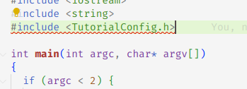

# Step 1: A basic starting point
Tutorial link: [Step 1: A basic starting point](https://cmake.org/cmake/help/latest/guide/tutorial/A%20Basic%20Starting%20Point.html)

## Build and run

Straightforward enough. Go to sample directory that contains one source file, and write the `CMakeLists.txt` file the tutorial says to.

Then to build. 

There's this sentence:
> First, run the cmake executable or the cmake-gui to configure the project and then build it with your chosen build tool.

I haven't chosen a build tool. Isn't CMake a build tool? 

Make a build directory (`Step1_build`) next to the source directory, go into it. 

```
$ mkdir Step1_build
$ cd Step1_build
```

> Next, navigate to the build directory and run CMake to configure the project and generate a native build system:

Native build system? What's that mean? I thought I was gonna use CMake to build.

Run cmake from build directory, pointing it at the source directory: `cmake ../Step1`

`cmake` runs, no error messages. Apparently, it makes a Makefile. So that's what it does.

```
...
-- Configuring done
-- Generating done
-- Build files have been written to:...
 ```

Build time! 
```
$ cmake --build .
```
It ... (drum roll) builds! And it runs. It takes a positive float or integer number and prints the square root. Not complex or negative numbers. A pity.

## Adding a Version Number and Configured Header File

Not done yet, there's more to be done in the `CMakeLists.txt` file.

`project()` statement: Add a version.

`project(Tutorial)` becomes `project(Tutorial VERSION 1.0)`.

> Then, configure a header file to pass the version number to the source code

Add a `configure_file(...)` line. Presumably at the bottom.

```configure_file(TutorialConfig.h.in TutorialConfig.h)```

Okay, so I guess ... this means there's a file `TutorialConfig.h.in` file that will generate `TutorialConfig.h`? Maybe? Except there isn't such a file, but maybe I'll be told to write it in a few paragraphs.

> Since the configured file will be written into the binary tree, we must add that directory to the list of paths to search for include files.

i'm sorry wat

What is the binary tree? What does it mean to be written into? Do you mean that the generated `.h` file is put in the build dir? Okay that would make sense since we're apparently avoiding generating files in the source dir.

And now, add these lines to CMakeLists.txt:
```
target_include_directories(Tutorial PUBLIC
                           "${PROJECT_BINARY_DIR}"
                           )
```
And that is apparently how the directory is added to the search path. Oughtn't this to be automatic, after all CMake knows it is generating a .h file. 

I'm guessing the variable points at the build dir.
Why the quotes around it? Guessing again: perhaps to protect from paths with spaces, like in Bash.

Last question here: What does PUBLIC mean? Non-answer: No idea!

Next: Write `TutorialConfig.h.in`. There it is!
```
#define Tutorial_VERSION_MAJOR @Tutorial_VERSION_MAJOR@
```
Okay so this is like a pre-preprocessor. I have told CMake the project name (Tutorial) and a VERSION (1.0), and it makes some variables out of that info.

And now, include the `TutorialConfig.h` in the C++ source file. This makes <span title="Visual Studio Code: An extensible code editor not related to Visual Studio. Good editor, misleading name that probably helped it get popular.">VS Code</span> unhappy, since the file hasn't been generated and therefore does not exist. But (SPOILER) build step makes the sad go away! Yay!

{:class=img-responsive}

Finally in this section, add a version statement to show that the pre-preprocessor pre-preprocessed the file into a file the preprocessor could preprocess as part of normal compilation.

Build/run step works fine, and makes VS Code happy about the include file.

## Specify the C++ Standard
We're not partying like it's 1999 anymore. Time to use C++ from a decade ago. This part seems overelaborate, this isn't a tutorial on how to modernize old C++ code. Just show me how to require a standard version in CMake, and use modern code from the start.

So, edit `tutorial.cxx` file: replace `atof()` with `std::stod()` and don't include `<cstdlib>`. Then add these lines to the middle of the `CMakeLists.txt` file (snarky comments optional):
```
# Specify the C++ standard
set(CMAKE_CXX_STANDARD 11)            # Use C++11
set(CMAKE_CXX_STANDARD_REQUIRED True) # No really, I mean it
```

It's important that these statements go above the `add_executable()` statement. Does that mean I can define multiple executables with different versions? Or perhaps just that the file is read in one pass, and the defaults applied to `add_executable()` if these lines come after. Speculations.

Question time. 
Why is `CMAKE_CXX_STANDARD_REQUIRED` a thing? What'd be the point of choosing a standard version if you're not going to use it?

## Rebuild
Builds. Runs. Computes. Step 1 done.
# Summary

## What I did

I made a CMakeLists file. It defines a project name, which I don't know what is. It defines an executable, which I know what is, and the source file that goes into building that executable.

I added a way to get version info from `CMakeLists.txt` into the program. Kind of like compiling with `g++ -DVERSION=1.0` but better.

I specified what C++ standard I wanted. Then I insisted.

## What I learned

CMake apparently isn't a build tool. CMake doesn't build directly, it creates Makefiles and calls Make in the background.

Building is (can be) done in a different directory from where the source files are. This is clever and obvious in hindsight, becauyse that way you avoid polluting the source tree with generated files and `make clean` becomes `rm -r build_dir`.

You can write template files and have CMake fill in variables. Like a pre-preprocessor. After telling CMake to process the templates, you have to tell it you want to use the result.

Using CMake templates can make VS Code sad because it can't find the files it needs. Building can make VS Code happy again because that creates those files and VS Code somehow finds them.

Order of statements in `CMakeLists.txt` matter.

## What I'm missing
I didn't choose a build tool. I don't know what PUBLIC means. Why do I need to insist on a standard? Why do I have to tell CMake I want to use the header I asked it to generate from a template?

## Other

Things are kind of in the wrong order around `TutorialConfig.h.in`. It is:

1. Reference file in CMakeLists
2. Define search path
3. Write the file
4. Use file in source

Bump step 3 to top of the list.  It makes more sense to write the file **first**. It's easier to understand what's going on with a file I've already written rather than vague hints about what I will need to do in the near future for steps 1 and 2 to make sense.


# Next: [Step 2: Adding a library](step02.html)
